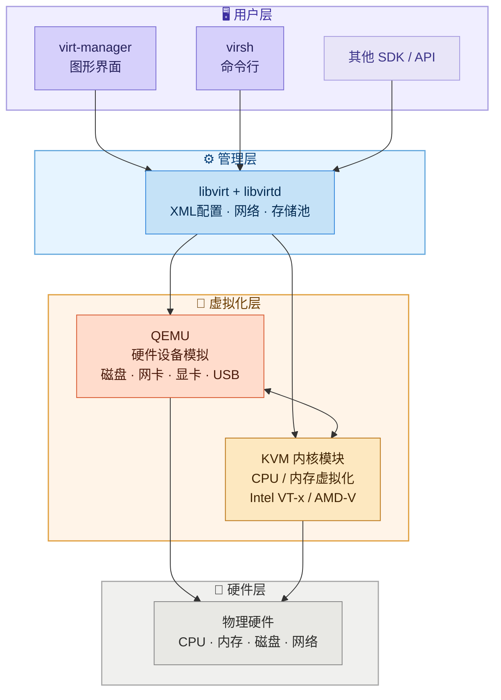

# 在 Arch Linux 中使用虚拟机

> [!note] 组件关系
> 本文综合使用 [[Linux/KVM|KVM]]（CPU/内存虚拟化）、[[Linux/QEMU|QEMU]]（设备模拟）、[[Linux/Libvirt|Libvirt]]（管理层）和 virt-manager（图形界面）搭建完整的虚拟化环境。各组件详解见对应笔记。

关于 KVM，2010年后生产的x86架构CPU几乎都有这个功能，最常见的拦路虎其实是 **BIOS/UEFI 中关闭了虚拟化**，进入 BIOS 手动开启即可。

KVM是Linux内核的一个模块，让内核本身变成一个Hypervisor，它利用CPU的硬件虚拟化扩展，让虚拟机可以直接在物理CPU上执行指令，而不是模拟执行，性能接近原生。

但是KVM只负责CPU和内存虚拟化，不能单独运行一个虚拟机，没有磁盘、网卡、显卡、等设备的模拟能力。

QEMU是一个完整的硬件模拟器，可以模拟CPU、磁盘、网卡、USB、显卡等各种设备。它完全用软件模拟硬件，因此可以跨架构运行。缺点是纯软件模拟性能较差。

实际上，总是KVM和QEMU结合使用：


| 组件 | 职责 |
| ---- | ---- |
| QEMU | 负责设备模拟（磁盘、网卡等） |
| KVM  | 负责CPU、内存虚拟化（硬件加速） |

这是Linux上主流的虚拟化方案。

Libvirt是一套管理虚拟化的中间层API和守护进程（libvirtd）。它把底层不同的虚拟化技术（QEMU/KVM、Xen、LXC等）统一抽象为一套接口，让上层工具不需要关心底层细节。

virt-manager是一个图形化前端，专门用来操作libvirt。它让你用鼠标点点点就能创建、启动、停止、配置虚拟机，而不需要手写XML或敲命令。

所以关系是：

virt-manager调用libvirt，libvirt管理QEMU/KVM。

你也可以不用virt-manager，直接用virsh命令行操作libvirt，效果一样。

![[Linux/assets/在Arch Linux使用虚拟机/file-20260519184052012.png]]



根据 [[Linux/KVM|KVM]]、[[Linux/QEMU|QEMU]] 以及 [[Linux/Libvirt|Libvirt]] 的知识，在 Arch Linux 上使用虚拟机需要以下操作：

## 环境配置

### 安装必要软件包

```shell
sudo pacman -S libvirt dnsmasq openbsd-netcat virt-manager virt-viewer qemu-full swtpm dmidecode
```

> [!info] 关键组件说明
> - `swtpm` —— 模拟 **TPM 2.0**，安装 Windows 11 必需
> - `dmidecode` —— 读取主板 DMI/SMBIOS 硬件信息，libvirt 用它收集宿主机信息以更好配置虚拟机

### 添加用户组

将自身添加进 `libvirt` 用户组：

```shell
sudo usermod -aG libvirt shiwu
```

### 开启守护进程

```shell
sudo systemctl enable --now libvirtd
```

## 安装 Windows 11

### 准备工作

> [!important]
> 需要提前下载两个镜像文件：
> - [Windows 11 安装镜像](https://www.microsoft.com/en-us/software-download/windows11)
> - [Virtio-win.iso](https://github.com/virtio-win/virtio-win-pkg-scripts)（VirtIO 驱动）

下载好这两个镜像后，放入 `/var/lib/libvirt/images` 文件夹。

### 创建虚拟机

打开 virt-manager，创建新的虚拟机，选择**本地安装介质**。

![[Linux/assets/在Arch Linux使用虚拟机/file-20260520114950715.png]]

之后，进入第二步，点击浏览，选择Win11安装镜像。

![[Linux/assets/在Arch Linux使用虚拟机/file-20260520114955993.png]]

进入第三步，合理配置CPU数量，不要超过最多可用数量。

![[Linux/assets/在Arch Linux使用虚拟机/file-20260520115001526.png]]

为Windows 11配置存储，80GB就够用了。

![[Linux/assets/在Arch Linux使用虚拟机/file-20260520115006511.png]]

由于我已经有了win11-1和win11-2，所以更改名称为win11-3，图片中显示的是win11-2，这和我已有的重名了。最后勾选在安装前自定义配置。

![[Linux/assets/在Arch Linux使用虚拟机/file-20260520115012257.png]]

### 配置虚拟硬件

> [!warning]
> 以下硬件配置对 Windows 11 安装至关重要，请按顺序操作。

修改 SATA 磁盘1的磁盘总线类型为 ==Virtio==。

![[Linux/assets/在Arch Linux使用虚拟机/file-20260520115018828.png]]

添加一个存储硬件，设备类型修改为CDROM设备，在选择或创建自定义存储中选择Virtio-win.iso文件。

![[Linux/assets/在Arch Linux使用虚拟机/file-20260520115023206.png]]

查看新增假的这个存储硬件，配置信息如下图：

![[Linux/assets/在Arch Linux使用虚拟机/file-20260520115029017.png]]

最后修改 TPM 硬件（==CRB== 设备，==2.0== 版本）如下图所示：

![[Linux/assets/在Arch Linux使用虚拟机/file-20260520120512996.png]]

### 开始安装

按照 Windows 11 安装向导逐步操作。

选择语言设置、键盘设置。

![[Linux/assets/在Arch Linux使用虚拟机/file-20260520115114867.png]]

![[Linux/assets/在Arch Linux使用虚拟机/file-20260520115118079.png]]

选择安装Windows 11，勾选我同意。

![[Linux/assets/在Arch Linux使用虚拟机/file-20260520115124825.png]]

有密钥填写密钥（淘宝可以购买激活密钥），没有密钥点击我没有密钥。

![[Linux/assets/在Arch Linux使用虚拟机/file-20260520115127631.png]]

无所谓选择哪个映像。

![[Linux/assets/在Arch Linux使用虚拟机/file-20260520115130663.png]]

点击接受。

![[Linux/assets/在Arch Linux使用虚拟机/file-20260520115134159.png]]

### 加载 VirtIO 驱动

到了这一步（选择安装位置时看不到任何磁盘），点击**加载驱动程序**。

![[Linux/assets/在Arch Linux使用虚拟机/file-20260520115137665.png]]

点击浏览。

![[Linux/assets/在Arch Linux使用虚拟机/file-20260520115140388.png]]

选择virtio-win-0.1.285，往下拉找到win11文件夹，选择amd64。

![[Linux/assets/在Arch Linux使用虚拟机/file-20260520115142794.png]]

![[Linux/assets/在Arch Linux使用虚拟机/file-20260520115145827.png]]

安装出现的这个驱动程序。

![[Linux/assets/在Arch Linux使用虚拟机/file-20260520115156160.png]]

驱动程序安装完成后，会回到这个界面，点击这个磁盘，然后 下一步。

![[Linux/assets/在Arch Linux使用虚拟机/file-20260520115203446.png]]

点击安装。

![[Linux/assets/在Arch Linux使用虚拟机/file-20260520115206997.png]]

出现这个，等待即可。

![[Linux/assets/在Arch Linux使用虚拟机/file-20260520115210790.png]]

### 跳过微软账户登录

之后会进入正常的 Windows 11 OOBE 设置。如果想要**跳过登录微软账户**：

> [!tip] 创建本地账户
> 按 ==Shift+F10==（或 Shift+Fn+F10）调出命令提示窗口，输入：
> ```shell
> start ms-cxh:localonly
> ```
> 该命令调用系统隐藏的本地账户创建界面，可以直接创建**本地账户**，绕过微软账户强制登录。

![[Linux/assets/在Arch Linux使用虚拟机/file-20260520122048468.png]]

![[Linux/assets/在Arch Linux使用虚拟机/file-20260520122212347.png]]

运行后：

![[Linux/assets/在Arch Linux使用虚拟机/file-20260520122310612.png]]

输入完后，点击下一步。

![[Linux/assets/在Arch Linux使用虚拟机/file-20260520122525243.png]]

### 安装 Guest Tools 与共享文件夹

进入电脑桌面后，在 Windows 11 中按以下顺序安装驱动和工具：

> [!important]
> 必须先安装 virtio-win-guest-tools，再安装 winfsp，顺序不可颠倒。

在 Windows 11 中浏览器搜索这个[网站](https://www.spice-space.org/download.html)下载并安装 `spice-guest-tools.exe`。

![[Linux/assets/在Arch Linux使用虚拟机/file-20260520095636557.png]]

这个[网站](https://winfsp.dev/rel/)下载 winfsp.msi。

![[Linux/assets/在Arch Linux使用虚拟机/file-20260520095648624.png]]

在 Windows 中安装驱动 virtio-win-guest-tools.exe。

![[Linux/assets/在Arch Linux使用虚拟机/file-20260520100918301.png]]

要先安装virtio-win-guest-tools.exe再安装winfsp.msi。

之后，在windows 11中，搜索services，然后向下搜索找到VirtIO-FS Service，右键点击后选择属性，将启动类型设置为自动，然后启动、应用，最后确定。

![[Linux/assets/在Arch Linux使用虚拟机/file-20260520101022063.png]]

![[Linux/assets/在Arch Linux使用虚拟机/file-20260520101038275.png]]

![[Linux/assets/在Arch Linux使用虚拟机/file-20260520101044898.png]]

回到virt-manager中，在内存硬件中，启用共享内存。

![[Linux/assets/在Arch Linux使用虚拟机/file-20260520101206751.png]]

在主机中创建共享文件夹。

![[Linux/assets/在Arch Linux使用虚拟机/file-20260520101459466.png]]

然后配置虚拟机中，添加硬件，选择文件系统，填写源路径。

![[Linux/assets/在Arch Linux使用虚拟机/file-20260520101126770.png]]

这时，主机上的/home/shiwu/Share与Windows 11宿主机上的Share(Z)是共享的。

再之后，就可以卸载windows安装iso硬件、virtio.io硬件了。

启动windows 11虚拟机。

安装过程可参考以下视频：
[Windows 11 on KVM/QEMU](https://youtu.be/woji50z1hF0?si=WzAPiNuh9FnSQoSB)

## 相关笔记

- [[Linux/KVM|KVM]] — CPU 和内存虚拟化的内核模块
- [[Linux/QEMU|QEMU]] — 硬件设备模拟器，含 TPM 配置说明
- [[Linux/Libvirt|Libvirt]] — 虚拟化管理中间层，含 virt-manager 配置
- [[工具|工具]] — 系统工具集，含 Ventoy（启动盘制作）、GParted（分区管理）
- [[任务清单/2026-05-19|2026-05-19 任务清单]] — 配置 KVM/QEMU 任务
- [[任务清单/2026-05-20|2026-05-20 任务清单]] — 配置 Win11 虚拟机及共享文件夹任务